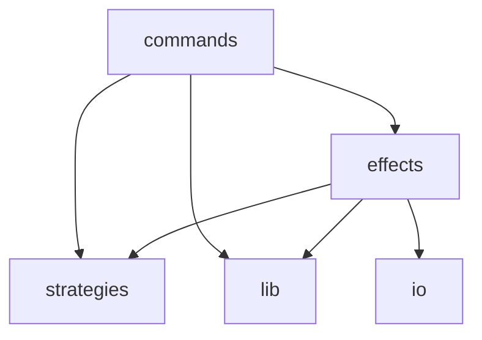

# Duplicate File Finder

<p align="right"><code>89.01% cov</code>&nbsp;<code>218 sloc</code>&nbsp;<code>24 files</code>&nbsp;<code>2 deps</code>&nbsp;<code>11 dev deps</code></p>

Finds duplicate files across given directories without hashing.

<br />

<!-- START doctoc generated TOC please keep comment here to allow auto update -->
<!-- DON'T EDIT THIS SECTION, INSTEAD RE-RUN doctoc TO UPDATE -->
## Table of Contents

- [Install](#install)
- [Usage](#usage)
- [Architecture](#architecture)

<!-- END doctoc generated TOC please keep comment here to allow auto update -->

## Install

###### <p align="right"><a href="https://www.npmjs.com/package/duplicate-file-finder">https://www.npmjs.com/package/duplicate-file-finder</a></p>
```
npm install duplicate-file-finder
```

## Usage

```js
const { findDuplicates } = require('duplicate-file-finder');
const sourcePath = 'photos'; // defaults to current directory.
const searchPaths = ['more-photos', 'even-more-photos']; // defaults to empty.
const duplicates = findDuplicates({ sourcePath, searchPaths }).then(duplicates => {
    // do something with duplicates.
});
```

`duplicates` is a data structure like:

```js
[
    [
        'photos/family.jpg',
        'more-photos/copy-of-family.jpg',
        'even-more-photos/another-copy-of-family.jpg'
    ],
    [
        'photos/pets.jpg',
        'more-photos/copy-of-pets.jpg'
    ]
]
```

## Architecture

###### <p align="right"><em>Can't see the diagram?</em> <a id="link-1" href="https://github.com/mattriley/node-duplicate-file-finder#user-content-link-1">View it on GitHub</a></p>

<p align="center">
  <em>This diagram was generated with <a href="https://github.com/mattriley/node-module-composer">Module Composer</a></em>
</p>
<br>
